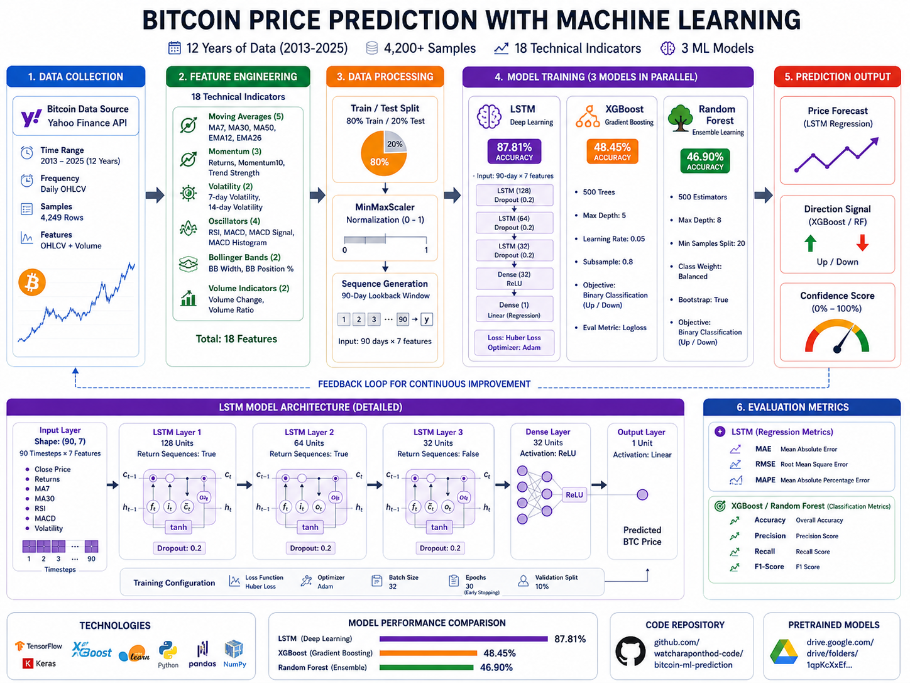

# Bitcoin Price Prediction using Deep Learning

A comprehensive machine learning system for Bitcoin price prediction using LSTM, XGBoost, and Random Forest models. The LSTM model achieves 87.81% accuracy on price regression tasks.



## Overview

This project implements three complementary machine learning models for Bitcoin price prediction:

- **LSTM Neural Network**: Deep learning model for price regression (87.81% accuracy)
- **XGBoost**: Gradient boosting for directional prediction (48.45% accuracy)
- **Random Forest**: Ensemble method for pattern recognition (46.90% accuracy)

The system analyzes 12 years of historical Bitcoin data (2013-2025) using 18 technical indicators to generate predictions.

## Key Features

- Multi-model ensemble approach combining deep learning and traditional ML
- 18 technical indicators including MA, EMA, RSI, MACD, and Bollinger Bands
- 90-day sequence modeling for temporal pattern recognition
- Comprehensive feature engineering pipeline
- Model serialization for production deployment

## Architecture

### LSTM Model

```
Input (90, 7) → LSTM(128) → Dropout(0.2) → LSTM(64) → Dropout(0.2)
→ LSTM(32) → Dropout(0.2) → Dense(32, ReLU) → Dense(1, Linear)
```

**Configuration:**
- Loss Function: Huber Loss (robust to outliers)
- Optimizer: Adam
- Batch Size: 32
- Early Stopping: Patience 5
- Learning Rate Reduction: Factor 0.5, Patience 3

### XGBoost Model

**Hyperparameters:**
- n_estimators: 500
- max_depth: 5
- learning_rate: 0.05
- subsample: 0.8
- colsample_bytree: 0.8
- eval_metric: logloss

### Random Forest Model

**Hyperparameters:**
- n_estimators: 500
- max_depth: 8
- min_samples_split: 20
- class_weight: balanced

## Dataset

**Source:** Yahoo Finance API (BTC-USD)
**Timeframe:** 2013-2025 (12 years)
**Frequency:** Daily OHLCV data
**Total Samples:** 4,200+ after feature engineering
**Train/Test Split:** 80/20

## Technical Indicators

The system employs 18 technical indicators grouped into five categories:

**Trend Indicators:**
- Simple Moving Averages (MA7, MA30, MA50)
- Exponential Moving Averages (EMA12, EMA26)

**Momentum Indicators:**
- Rate of Return
- Momentum (10-day)
- Trend Strength

**Volatility Indicators:**
- 7-day Volatility
- 14-day Volatility
- Bollinger Bands Width
- Bollinger Bands Position

**Oscillators:**
- Relative Strength Index (RSI)
- MACD
- MACD Signal
- MACD Histogram

**Volume Indicators:**
- Volume Change
- Volume Ratio

## Installation

```bash
# Clone repository
git clone https://github.com/watcharaponthod-code/bitcoin-ml-prediction.git
cd bitcoin-ml-prediction

# Install dependencies
pip install numpy pandas yfinance scikit-learn xgboost tensorflow joblib

# Optional: Install in virtual environment
python -m venv venv
source venv/bin/activate  # On Windows: venv\Scripts\activate
pip install -r requirements.txt
```

## Usage

### Training Models

```bash
python train_and_save_model.py
```

This script will:
1. Download 12 years of Bitcoin data from Yahoo Finance
2. Engineer 18 technical indicators
3. Train all three models (LSTM, XGBoost, Random Forest)
4. Save trained models to disk

### Loading and Using Models

```python
import joblib
from tensorflow.keras.models import load_model

# Load models
lstm_model = load_model('bitcoin_lstm_model.keras')
xgb_model = joblib.load('bitcoin_xgb_model.pkl')
rf_model = joblib.load('bitcoin_rf_model.pkl')

# Load scalers
scaler_features = joblib.load('scaler_features.pkl')
scaler_close = joblib.load('scaler_close.pkl')

# Prepare input data (example)
# X_input should be shape (90, 7) for LSTM
lstm_prediction = lstm_model.predict(X_input)

# For XGBoost/Random Forest (shape: (n_samples, 18))
xgb_prediction = xgb_model.predict(X_features)
rf_prediction = rf_model.predict(X_features)
```

## Results

### Model Performance

| Model | Type | Accuracy/MAPE | MAE | RMSE | Use Case |
|-------|------|---------------|-----|------|----------|
| LSTM | Regression | 87.81% | $2,847 | $5,219 | Price Forecasting |
| XGBoost | Classification | 48.45% | - | - | Direction Prediction |
| Random Forest | Classification | 46.90% | - | - | Signal Confirmation |

### LSTM Performance Metrics

- **Accuracy (100-MAPE):** 87.81%
- **Mean Absolute Error:** $2,847
- **Root Mean Square Error:** $5,219
- **Training Epochs:** 30 (with early stopping)

### Feature Importance (XGBoost)

Top 5 most important features:
1. RSI (Relative Strength Index)
2. MACD Histogram
3. 7-day Volatility
4. MA30 (30-day Moving Average)
5. Volume Ratio

## Trained Models

Pre-trained models are available for download:

**Google Drive Folder:** [Bitcoin-ML-Models](https://drive.google.com/drive/folders/1qpKcXxEf4aPNdUxSPRWnJ_0kVbXAlBt1)

Individual model files:

| File | Size | Description | Download |
|------|------|-------------|----------|
| bitcoin_lstm_model.keras | 1.6 MB | LSTM model weights | [Download](https://drive.google.com/uc?export=download&id=12BPy4upY6XvjPtS-gV5ZqPfo4QJVTfRC) |
| bitcoin_xgb_model.pkl | 1.1 MB | XGBoost model | [Download](https://drive.google.com/uc?export=download&id=1spdq1y3QmamtxKrJRsmHThLsCbQLCyXR) |
| bitcoin_rf_model.pkl | 5.4 MB | Random Forest model | [Download](https://drive.google.com/uc?export=download&id=1Cmjtw0z1XmMKkl90wLVt604ajh8mXOgH) |
| scaler_features.pkl | 959 B | Feature scaler | [Download](https://drive.google.com/uc?export=download&id=19MVRutA0AZ9HuCaWEAF3HtAP6T62ulOl) |
| scaler_close.pkl | 719 B | Price scaler | [Download](https://drive.google.com/uc?export=download&id=1ttQO_ULNFB0J0HoKCCtPeO4ZPiEZVAR5) |

## Project Structure

```
bitcoin-ml-prediction/
├── README.md                      # Project documentation
├── train_and_save_model.py       # Training script
├── run_model.py                  # Evaluation script
├── architecture_diagram.png      # System architecture
├── requirements.txt              # Python dependencies
├── models/                       # Trained models (Git LFS)
│   ├── bitcoin_lstm_model.keras
│   ├── bitcoin_xgb_model.pkl
│   ├── bitcoin_rf_model.pkl
│   ├── scaler_features.pkl
│   └── scaler_close.pkl
└── .gitignore
```

## Methodology

### 1. Data Collection
- Download historical BTC-USD data from Yahoo Finance
- Timeframe: 12 years (2013-2025)
- Frequency: Daily OHLCV

### 2. Feature Engineering
- Calculate 18 technical indicators
- Handle missing values
- Create target variable (7-day ahead prediction)

### 3. Data Preprocessing
- Split data: 80% training, 20% testing
- Normalize features using MinMaxScaler (0-1 range)
- Generate sequences for LSTM (90-day lookback window)

### 4. Model Training
- Train LSTM with early stopping and learning rate reduction
- Train XGBoost with class balancing
- Train Random Forest with balanced weights

### 5. Evaluation
- Calculate accuracy, MAE, RMSE for LSTM
- Calculate accuracy, precision, recall for classification models
- Perform threshold analysis for confidence-based predictions

## Dependencies

- Python 3.8+
- numpy
- pandas
- yfinance
- scikit-learn
- xgboost
- tensorflow 2.x
- joblib

See `requirements.txt` for specific versions.

## Limitations and Future Work

### Current Limitations
- Classification models show ~50% accuracy (close to random prediction)
- Limited to daily timeframe
- Does not account for external market factors (news, regulations)
- No real-time prediction capability

### Future Improvements
- Implement attention mechanisms in LSTM
- Add sentiment analysis from news/social media
- Incorporate macroeconomic indicators
- Develop real-time prediction pipeline
- Experiment with Transformer models
- Add explainability (SHAP values)

## Disclaimer

This project is for educational and research purposes only. Cryptocurrency markets are highly volatile and unpredictable. The models provided should not be used for actual trading decisions without proper risk management and additional validation. Always conduct your own research and consult with financial advisors before making investment decisions.

## License

MIT License

Copyright (c) 2025

Permission is hereby granted, free of charge, to any person obtaining a copy of this software and associated documentation files (the "Software"), to deal in the Software without restriction, including without limitation the rights to use, copy, modify, merge, publish, distribute, sublicense, and/or sell copies of the Software, and to permit persons to whom the Software is furnished to do so, subject to the following conditions:

The above copyright notice and this permission notice shall be included in all copies or substantial portions of the Software.

THE SOFTWARE IS PROVIDED "AS IS", WITHOUT WARRANTY OF ANY KIND, EXPRESS OR IMPLIED, INCLUDING BUT NOT LIMITED TO THE WARRANTIES OF MERCHANTABILITY, FITNESS FOR A PARTICULAR PURPOSE AND NONINFRINGEMENT. IN NO EVENT SHALL THE AUTHORS OR COPYRIGHT HOLDERS BE LIABLE FOR ANY CLAIM, DAMAGES OR OTHER LIABILITY, WHETHER IN AN ACTION OF CONTRACT, TORT OR OTHERWISE, ARISING FROM, OUT OF OR IN CONNECTION WITH THE SOFTWARE OR THE USE OR OTHER DEALINGS IN THE SOFTWARE.

## References

1. Hochreiter, S., & Schmidhuber, J. (1997). Long Short-Term Memory. Neural Computation, 9(8), 1735-1780.
2. Chen, T., & Guestrin, C. (2016). XGBoost: A Scalable Tree Boosting System. Proceedings of the 22nd ACM SIGKDD International Conference on Knowledge Discovery and Data Mining.
3. Breiman, L. (2001). Random Forests. Machine Learning, 45(1), 5-32.
4. McNally, S., Roche, J., & Caton, S. (2018). Predicting the Price of Bitcoin Using Machine Learning. 26th Euromicro International Conference on Parallel, Distributed and Network-based Processing (PDP).

## Citation

If you use this code in your research, please cite:

```bibtex
@misc{bitcoin_ml_prediction_2025,
  author = {Watcharapon Thod},
  title = {Bitcoin Price Prediction using Deep Learning},
  year = {2025},
  publisher = {GitHub},
  url = {https://github.com/watcharaponthod-code/bitcoin-ml-prediction}
}
```

## Contact

For questions or collaborations:
- GitHub: [@watcharaponthod-code](https://github.com/watcharaponthod-code)
- Repository: [bitcoin-ml-prediction](https://github.com/watcharaponthod-code/bitcoin-ml-prediction)
